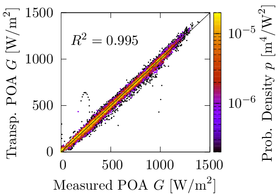
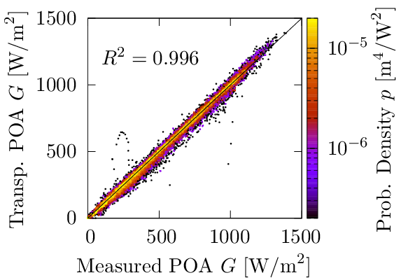
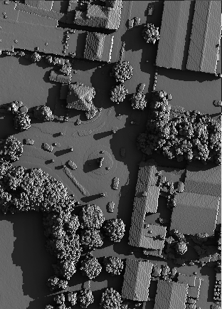
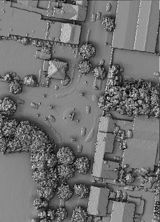

# SSDP

## The Simple Sky Dome Projector

The [Simple/Slick/Stupid/Smart/../Slimy/Sexy] Sky Dome Projector (SSDP)
(have not decided yet which adjective fits best, there is just so many) 
is a library for modeling irradiance taking into account the local 
topography. It implements a hexagonal mesh for the sky and the Perez 
all weather sky model. For the topography it works with a point cloud 
of x,y,z coordinates or a regular grid. It can compute the horizon as 
seen from a specific location in the topography and can project the 
modeled sky dome onto a surface with a specified tilt and orientation. 
The surface location and orientation may be adapted to the topography 
(e.g. specify height above the surface and adapt the orientation to the 
surface normal).

## Features
* Implements a uniform sky and the Perez all weather sky model [1]
	* variable size hexagonal sky-dome mesh
	* sun taken separately as a point source a alleviate sky-mesh 
	resolution requirements
* Computes solar position given the latitude and lonitude and the 
UTC time (specified as Unix Time) using the spa algorithm [2] 
as implemented by freespa [3]
	* also supports a manual specification of azimuth and zenith angles
* Simple and fast irradiance computation
	* easy specification of location (x,y,z) and orientation 
	(azimuth,zenith) of the incident plane
	* Traces incident light
	* Crude "one bounce" approximation for albedo (no ray tracing, it 
	is a fully "local" model)
	* only computes irradiance at specified locations
* 2.5D topography
	* Supports both unstructured and regular meshes for the topography

## Examples
As a validation of the irradiance and transposition models in ssdp we 
compare simulated plane of array irradiance values with 
[pvlib](https://github.com/pvlib/pvlib-python). To this end we take
measured GHI, DHI, and POA data from a location somewhere in the south 
of germany, and use the measured GHI and DHI to predict the POA 
irradiance. The POA in this case is a 40 degrees tilt, facing south. We 
assume a ground albedo of 0.25. For this simulation we do not take into 
account any topography (the data is for an open field) so we only look 
at irradiance and transposition modeling. For both ssdp and pvlib we 
use a Perez model (ssdp uses [1] and pvlib a slightly different model 
[4]). The results are shown in Fig. 1 for ssdp (top) and pvlib 
(bottom). Both models perform well with a coefficient of determination 
of more than R2=0.995. Small differences (~0.1% range) are 
observed and expected due to the different methods and models.

 

_Fig. 1 Transposition and irradiance modeling with (top) ssdp, and 
(bottom) pvlib_
  
In Fig. 2 we show two examples where we compute shading. The topography 
comes from LIDAR data. We compute the irradiation intensity on the 
topography surface. In Fig 2 (top) the surface irradiance is computed 
at some location for the 15th of june 2015 at 08:00 for a 
GHI of 500 W/m2 and a DHI of 200 W/m2. In Fig. 2 
(bottom) we integrated the irradiance for a complete summer week.
 

_Fig. 2 (top) Example irradiance computation at one particular moment. 
(bottom) Example for the integrated irradiance over one summer week_

## Installation
The SSDP program comes with autotools build scripts, hence the 
installation procedure follows the standard:

1. `./configure`
2. `make`
3. `(sudo) make install` 

This installs both the ssdp library and the ssdp command-line program. 

The configure command takes several optional arguments. Specific ssdp 
options are:

* --enable-openmp: Use openmp palatalization (disabled per default) 
* --disable_fastatan2: Disables a fast atan2 approximation
* --enable-gendaylit: Enables the gendaylit modifications to the Perez 
model

Compiler optimizations:

Do not use unsafe math optimizations. With gcc/clang I would recommend 
'-O3' and '-march=native', e.g.

`./configure CFLAGS='-march=native -O3' --enable-openmp`

## Documentation

The ssdp program comes with man pages. If you have the man program and
ssdp installed you can do

`man ssdp` 

to read the documentation. Otherwise you can produce a readable manual 
using the groff program and the ssdp.man file, e.g.:

`groff -man -T pdf src/ssdp.man > ssdp_manual.pdf`

(assuming your working directory is the root source directory of ssdp)

## References
[1] R. Perez, et al. "All-Weather Model for Sky Luminance Distribution 
-- Preliminary Configuration and Validation." Solar Energy  50.3 
(1993):235-245

[2] R. Ibrahim and A. Afshin "Solar position algorithm for solar 
radiation applications" Solar Energy 76.5 (2004): 577-589

[3] freespa (insert github address as it is available)

[4] R. Perez, et al. "Modeling daylight availability and irradiance 
components from direct and global irradiance". Solar Energy 44.5 
(1990):271-289.

